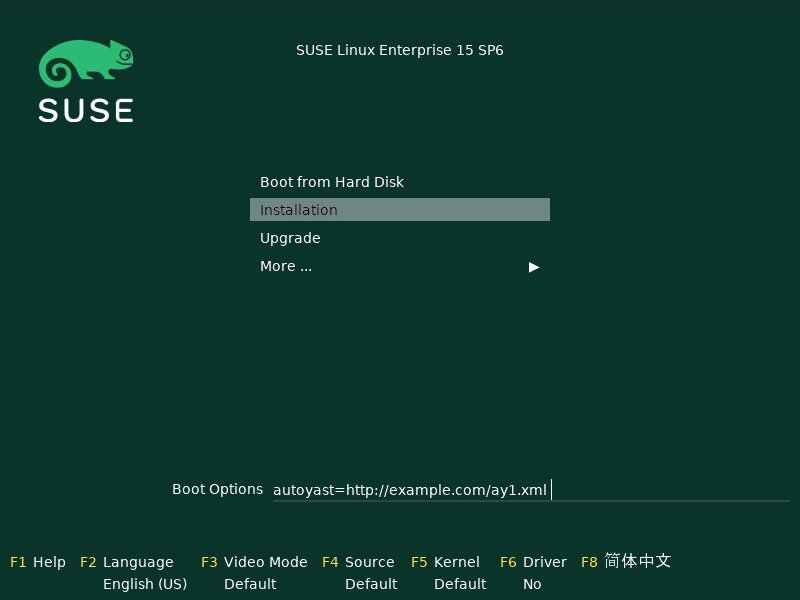
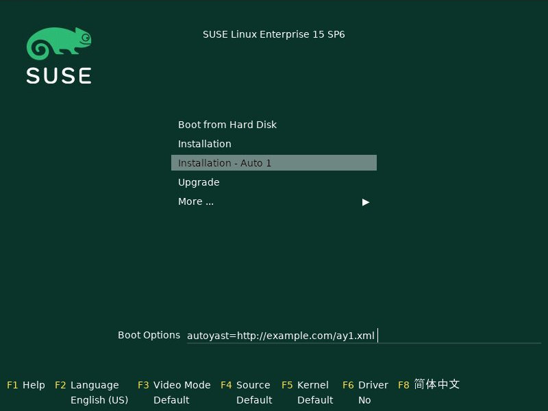

= Tooling for SUSE and Multi-Linux installation / Live media
:toc: preamble
:toclevels: 3

When you are doing Linux installations regularly or have a large number of
machines to deploy you might want to make changes to the official
installation media to make work more efficient.

This might range from having your network setup parameters integrated to
running your favorite autoyast or kickstart profile automatically to
integrating a driver update or a fixed package without which you cannot run
the installation to upgrading to latest kernel and modules your hardware
require to updating the entire installer.

Or you might want to have a size reduced variant of the full media containing
only the software modules and products you need. Or minimalistic media for
purely network-based installations.

There is a group of tools that lets you do all this easily. They come in two
packages: `checkmedia` and `mksusecd`.

A lesser known fact is that these tools work not only with SUSE media but
also with Multi-Linux media. That is, with Fedora, RHEL, CentOS, and
other RHEL derivatives. And not only with installation media but also
Live media.

Supported are:

- openSUSE media (Leap, Tumbleweed, Slowroll)
- SLE-11, SLE-12, SLE-15 (YaST installer)
- SLE-16 (Agama installer)
- SLE-Micro self-install images
- any KIWI-generated installation media
- SUSE Multi-Linux media
- Fedora, RHEL, and derivatives (CentOS, Rocky, AlmaLinux, ...) media

This article will introduce these tools and walk you through a number of
use cases.

Note that these tools are not suitable for creating installation or Live media from
scratch. You always have to have some existing ISO image to start with.

Note also that these media are not only suitable to be used as ISO for
burning DVDs but are at the same time also hybrid images to be used as disks
(USB media). You can even produce pure disk images and skip the ISO part if
you are going to use them only as disk images.

== checkmedia and tagmedia

Both `checkmedia` and `tagmedia` are part of the `checkmedia` package.

`checkmedia` is the tool for users to verify the correctness of downloaded
media. It relies on embedded meta data like an sha256 digest and/or gpg
signature to work. The Multi-Linux equivalent is `checkisomd5`.

`tagmedia` manages or creates these meta data. The Multi-Linux equivalent
is `implantisomd5`.

Let's have a look at two typical examples:

[source]
----
# checkmedia Fedora-Server-netinst-x86_64-41-1.4.iso
        app: Fedora-S-dvd-x86_64-41
   iso size: 932520 kiB
       skip: 30 kiB
   checking: 100%
     result: iso md5 ok, fragments md5 ok
        md5: 7675831e6771993c605ba4808d57ecab
  signature: not signed
----

[source]
----
# checkmedia openSUSE-Tumbleweed-DVD-x86_64-Snapshot20250522-Media.iso 
        app: openSUSE-Tumbleweed-DVD-x86_64-Build4388.1-Media
   iso size: 4546910 kiB
        pad: 300 kiB
  partition: start 7612 kiB, size 4539972 kiB
   checking: 100%
     result: iso sha256 ok, partition sha256 ok
     sha256: 3d0d694634c0ed76a38f4960e95894d7a754b96a23d7d102ee4a7f302b32b3f4
  signature: ok
  signed by: openSUSE Project Signing Key <opensuse@opensuse.org>
----

You can see that both images are correct. Fedora is using md5 instead of
sha256, though. The shown md5 and sha256 digests are the values you would
get if you were to run `md5sum` or `sha256sum` commands on the image
files.

In addition, the digest meta data stored in the openSUSE image are signed
using the openSUSE key. The key is available on every Tumbleweed system - as
part of the `openSUSE-build-key` package. This way you can be sure the image
has not been modified by anyone.

Without a signature you have to rely on manually comparing the md5 or sha256
digests with values you get from trustworthy sources.

`tagmedia` gives an insight into the meta data block holding the digest data:

[source]
----
# tagmedia Fedora-Server-netinst-x86_64-41-1.4.iso
ISO MD5SUM = 67f0b58caf55a50887e4d0068eb625c6
SKIPSECTORS = 15
RHLISOSTATUS = 0
FRAGMENT SUMS = ad5a88259b4dc247c12d5c248fd3e986d2c55bdb5181284b4e246dca1577
FRAGMENT COUNT = 20
THIS IS NOT THE SAME AS RUNNING MD5SUM ON THIS ISO!!
----

[source]
----
# tagmedia openSUSE-Tumbleweed-DVD-x86_64-Snapshot20250522-Media.iso
check = 1
pad = 150
sha256sum = 57d52ef2c779d0fe4f40e03d80b599c72f9b401022d19700f7860457540355c6
partition = 15224,9079944,621370e05b0ef2438db4ac6c407c9c501914ba49878a5bf0dd5ba698ad90af3c
signature = 30448
----

You will immediately notice the md5 and sha256 digests stored in the meta
data are not the same as the calculated digests shown by `checkmedia`.
Fedora even embeds a line warning people about this. The stored digest is in
both cases the digest calculated excluding the meta data block.

If there is a `signature` entry it points to the start of a signature block.

As an experiment, let's sign the Fedora image. Say, you have a gpg key
`susetest` in your key ring; you can do:

[source]
----
# tagmedia --create-signature susetest Fedora-Server-netinst-x86_64-41-1.4.iso
public key for verifying Fedora-Server-netinst-x86_64-41-1.4.iso written to Fedora-Server-netinst-x86_64-41-1.4.iso.key
----

Let's check what changed:

[source]
----
# tagmedia Fedora-Server-netinst-x86_64-41-1.4.iso 
ISO MD5SUM = 67f0b58caf55a50887e4d0068eb625c6
SKIPSECTORS = 15
RHLISOSTATUS = 0
FRAGMENT SUMS = ad5a88259b4dc247c12d5c248fd3e986d2c55bdb5181284b4e246dca1577
FRAGMENT COUNT = 20
THIS IS NOT THE SAME AS RUNNING MD5SUM ON THIS ISO!!
SIGNATURE = 1864980
----

You can see a newly added `SIGNATURE` entry.

For convenience, `tagmedia` has also stored the public part of the key in
`Fedora-Server-netinst-x86_64-41-1.4.iso.key` - you will need it to verify the signature:

[source]
----
# gpg Fedora-Server-netinst-x86_64-41-1.4.iso.key
gpg: WARNING: no command supplied.  Trying to guess what you mean ...
pub   ed25519 2025-05-16 [SC] [expires: 2028-05-15]
      CC3DFF978856FF27B1A53BD88C471DBABABCEC4C
uid           susetest
sub   cv25519 2025-05-16 [E] [expires: 2028-05-15]
----

Now, run `checkmedia` again:

[source]
----
# checkmedia \
  --key-file Fedora-Server-netinst-x86_64-41-1.4.iso.key \
  Fedora-Server-netinst-x86_64-41-1.4.iso
        app: Fedora-S-dvd-x86_64-41
   iso size: 932520 kiB
       skip: 30 kiB
   checking: 100%
     result: iso md5 ok, fragments md5 ok
        md5: fa2076cd08cb69b002afdeb2faad629a
  signature: ok
  signed by: susetest
----

Note that although the md5 digest of the image has changed (the image now
contains the gpg signature) the stored md5 digest shown by `tagmedia` has not
- this is because as mentioned previously the stored md5 digest is
calculated excluding the meta data block.

Note also that `checkisomd5` will ignore the signature, but the file will
still be correct from the perspective of `checkisomd5`, even with embedded
signature.

== verifymedia

`verifymedia` and `mksusecd` are part of the `mksusecd` package. These tools
are for people creating new or modified media.

In contrast to `checkmedia`, `verifymedia` testifies technical correctness:

[source]
----
# verifymedia openSUSE-Tumbleweed-DVD-x86_64-Snapshot20250522-Media.iso
Verifying: openSUSE-Tumbleweed-DVD-x86_64-Snapshot20250522-Media.iso
Check results: [✔] = ok, [✘] = bad, [!] = not ideal
[✔] image has ISO-9660 file system
[✔] image uses Rock Ridge extension
[✔] image uses Joliet extension
[✔] image has volume id
[✔] all files are world-readable
[✔] all files are owned by root
[✔] media style: suse
[✔] media variant: install
[✔] media architecture: x86_64
[✔] media layout supported
[✔] .treeinfo architecture matches
[✔] kernel and initrd referenced in .treeinfo exist
[✔] kernel exists
[✔] initrd exists
[✔] isolinux config exists
[✔] UEFI grub config exists
[✔] UEFI grub config references correct root file system
[✔] UEFI boot loader exists
[✔] UEFI boot image exists
[✔] no garbage files
[✔] has MBR or GPT partition table
[✔] has boot partition with VFAT file system
[✔] boot partition type is EFI System Partition
[✔] boot partition refers to UEFI boot image file
[✔] has data partition pointing to ISO image
[✔] ISO data partition has non-zero offset
[✔] no invalid partition entries
[✔] El Torito x86 legacy bootable
[✔] El Torito UEFI bootable
[✔] El Torito UEFI entry points to boot partition
[✔] ISO has digest
[✔] ISO digest is sha256 or better
[✔] ISO is ready to be signed
[✔] ISO is signed
----

Looks really good. :-)

But this is not always the case. If you are curious, experiment a bit with publicly available installation media.

Here is some slightly incorrect example:

[source]
----
# verifymedia openSUSE-Tumbleweed-NET-aarch64-Snapshot20250522-Media.iso
Verifying: openSUSE-Tumbleweed-NET-aarch64-Snapshot20250522-Media.iso
Check results: [✔] = ok, [✘] = bad, [!] = not ideal
...
[✘] .treeinfo architecture matches
  'x86_64' != 'aarch64'
  'arch' entry in 'general' section in .treeinfo must match media architecture.
[✘] kernel and initrd referenced in .treeinfo exist
  boot/x86_64/loader/initrd
  boot/x86_64/loader/linux
  Kernel and initrd referenced in .treeinfo must exist.
...
----

In this case, the `.treeinfo` file does not use the correct architecture.

If you create media yourself with `mksusecd` and run into problems, it might be a good idea
to check your modified media with `verifymedia` for signs of trouble.

== mksusecd

`mksusecd` (in package `mksusecd`) is the tool to modify existing installation or Live images.

Typical things you can do include

- set boot options
- set installer config options
- create online / network installation media from full installation media
- create customized SLE media containing selected products and SLE-modules
- create media with updated installer using tftpboot-installation-<PRODUCT> packages
- update kernel, modules, and firmware on installation media
- integrate changes into installation system or initrd
- integrate driver updates
- integrate add-on repositories

Some advanced use-cases

- create pure disk image (no ISO image)
- update shim or grub
- sign your own media
- sign Multi-Linux / RHEL media

Let's go through the list looking at some examples.

=== Set boot options

The `--boot` option lets you add a new boot option.
For example, to have an AutoYaST installation as default, add a reference to your AutoYaST file:

[source]
----
# mksusecd --create new.iso \
  --boot "autoyast=http://example.com/ay1.xml" \
  SLE-15-SP6-Online-x86_64-QU2-Media1.iso
media style suse, variant install
Repositories:
  SLES15-SP6 [15.6-0]
assuming repo-md sources
using signing key, keyid = 7B0EC6208CA8E305
El-Torito legacy bootable (x86_64)
UEFI image: boot/x86_64/efi
updating UEFI image: boot/x86_64/efi
El-Torito UEFI bootable (x86_64)
building: 100%
calculating sha256...
----

This is what the boot screen now looks like:

.Boot screen with AutoYaST option added
[%collapsible]
====

====

You can use `--add-entry` to create a separate entry instead of modifying
the default boot entry:

[source]
----
# mksusecd --create new.iso \
  --boot "autoyast=http://example.com/ay1.xml" \
  --add-entry "Auto 1" \
  SLE-15-SP6-Online-x86_64-QU2-Media1.iso
...
----

.Boot screen with separate AutoYaST entry
[%collapsible]
====

====

Another thing you might want to change is the default kernel console, for example on aarch64:

[source]
----
# mksusecd --create new.iso \
  --boot "console=ttyAMA0" \
  SLE-15-SP6-Online-aarch64-QU2-Media1.iso
...
----

For a documentation of possible boot options look here:

1. https://en.opensuse.org/SDB:Linuxrc (linuxrc, YaST)
2. https://agama-project.github.io/docs/user/boot_options (Agama)
3. https://anaconda-installer.readthedocs.io/en/latest/boot-options.html (Anaconda)
4. https://github.com/dracutdevs/dracut/blob/master/man/dracut.cmdline.7.asc (dracut)

=== Set installer config options

In most cases, boot options will be intended not for the kernel but for the installer. In
this case you can have configration options integrated into the initrd directly.

For example, setting the AutoYaST parameter could instead be done this way:

[source]
----
# mksusecd --create new.iso \
  --initrd-config "autoyast=http://example.com/ay1.xml" \
  SLE-15-SP6-Online-x86_64-QU2-Media1.iso
...
----

The advantage is that you can take kernel and initrd from the new installer
medium and use it in a different context, for example as PXE boot files,
without worrying about passing the correct boot options.

Also, there are situations where you might not have an interactive boot
loader. You can then prepare the initrd to suit your needs.

For example, on IBM z Systems the created media are directly zIPL-bootable (the
official SLE-15 media are not). If you turn off manual mode and add
all necessary settings, you can use these media without any console
interaction:

[source]
----
# mksusecd --create new.iso \
  --boot "-manual" \
  --initrd-config "autoyast=https://example.com/foo" \
  SLE-15-SP6-Online-s390x-GM-Media1.iso
media style suse, variant install
Repositories:
  SLES15-SP6 [15.6-0]
Warning: more than one kernel/initrd pair to choose from
(Use '--arch' option to select a different one.)
Using boot/s390x/linux & boot/s390x/initrd.
assuming repo-md sources
using signing key, keyid = 7B0EC6208CA8E305
zIPL bootable (s390x)
El-Torito legacy bootable (x86_64)
El-Torito legacy bootable (s390x)
building: 100%
calculating sha256...
----

=== Create online/network installation media from full media

There are two types of network-based installation media:

1. media that contain the installer (online media)
2. smaller media that do not contain the installer (network media)

To avoid confusion, in this document the first type will be refered to as online media, the second as network media.

Both variants do not contain the installation software repository.

There is a third type of installation media: offline media that contain installer and software repository,
here referred to as full media.

Examples for the first variant are SLE online media or Fedora netinst media. The second variant is
used by Leap and Tumbleweed NET media. Note that for the second variant even the installer
is loaded via network - that is, there must be a URL pointing at some
location providing the installer for download.

Note that the steps in the examples below look similar, details differ mainly due to the fact
that three different installation programs are used:

1. SLE-15, Leap-15, Tumbleweed: YaST
2. SLE-16, Leap-16, (future) Tumbleweed: Agama
3. Multi-Linux, Fedora, RHEL: Anaconda

Let's look at some examples that create online and network media from full media.

==== 1. SLE15, SLE-16, Leap-16 online media

[source]
----
# mksusecd --create new.iso \
  --micro \
  SLE-15-SP6-Full-x86_64-GM-Media1.iso
----

Option `--micro` will make `mksusecd` remove all files except the installer
and those needed for booting. For SLE media you do not need to pass a
repository because the repository information is read from a registration
server. Leap-16 has the online repo location already in its configuration.
`new.iso` is equivalent to SLE/Leap online media.

==== 2. Tumbleweed, Leap-15 online media (not officially available)

[source]
----
# mksusecd --create new.iso \
  --micro \
  --defaultrepo=https://download.opensuse.org/tumbleweed/repo/oss \
  openSUSE-Tumbleweed-DVD-x86_64-Snapshot20250614-Media.iso
----

As in the last example, option `--micro` will keep the installer on the medium.
But for Tumbleweed and Leap-15 you need to provide the repository location using the `--defaultrepo` option.

The difference to the Tumblweed network medium which is available for download is
that you can use this image for installing any Tumbleweed snapshot.

==== 3. Multi-Linux, Fedora online media

If there is no repository on the installation medium, the installer will
usually automatically try to get an online repository from a mirror list.

This works nice for Fedora, for example; all you have to do is:

[source]
----
# mksusecd --create new.iso \
  --micro \
  Fedora-Server-dvd-x86_64-42-1.1.iso
...
----

If an online repository cannot be found automatically or you have your own repository set up anyway, specify the online repository explicitly:

[source]
----
# mksusecd --create new.iso \
  --micro \
  --initrd-config inst.repo=https://example.com/foo \
  SUSE-Liberty-Linux-9.6.DVD-x86_64.iso
...
----

The `inst.repo` option should point to a location containing the unpacked full media.

The media produced in this way are equivalent to the available netinst/netinstall media.

==== 4. Tumbleweed, Leap-15 network media (no installer)

[source]
----
# mksusecd --create new.iso \
  --nano \
  --defaultrepo=https://download.opensuse.org/distribution/leap/15.6/repo/oss \
  openSUSE-Leap-15.6-DVD-x86_64-Build710.3-Media.iso
----

Option `--nano` leaves ony files needed for booting kernel and initrd. In contrast to `--micro` it
also removes the installer from the medium.

As in the Tumbleweed online example, you also need to set the repository location. The installer is loaded
from a pre-defined location (from the `boot/<ARCH>` subdirectory) within the repository.

==== 5. Leap-16, SLE-16 network media (no installer, not officially available)

[source]
----
# mksusecd --create new.iso \
  --nano \
  --initrd-config root=live:https://example.com/foo/squashfs.img \
  Leap-16.0-offline-installer-x86_64.install.iso
----

For Agama-based media like Leap-16 or SLE-16 you have to provide the Live root file system
via network yourself - there is currently no official download location.
For this, copy `squashfs.img` from the full medium and make it available on a server.

Leap-16 has a default repository location in its config, you do not need to set it.
But if you want to pass your own repository, use the `inst.install_url` setting like this:

[source]
----
# mksusecd --create new.iso \
  --nano \
  --initrd-config root=live:https://example.com/foo/squashfs.img \
  --initrd-config inst.install_url=https://download.opensuse.org/distribution/leap/16.0/repo/oss \
  Leap-16.0-offline-installer-x86_64.install.iso
----

==== 6. Multi-Linux, Fedora network media (not officially available)

For network media you have to prepare a server location containg the unpacked full medium.
Say, it is available at `+https://example.com/foo+`.

Then use the `inst.stage2` option to point at that location. The installer will be downloaded from there.

[source]
----
mksusecd --create new.iso \
  --nano \
  --boot -inst.stage2 \
  --initrd-config inst.stage2=https://example.com/foo \
  Fedora-Server-dvd-x86_64-42-1.1.iso
...
----

Note that since `inst.stage2` is used in the boot config, the command removes it from there. Otherwise setting `inst.stage2`
in the initrd would have no effect.

Alternatively, you could instead do:

[source]
----
mksusecd --create new.iso \
  --nano \
  --boot inst.stage2=https://example.com/foo \
  Fedora-Server-dvd-x86_64-42-1.1.iso
...
----

For Multi-Linux - where you have to set the repository location explicitly - the command would look like this:

[source]
----
# mksusecd --create new.iso \
  --nano \
  --boot -inst.stage2 \
  --initrd-config inst.stage2=https://example.com/foo \
  --initrd-config inst.repo=https://example.com/foo \
  SUSE-Liberty-Linux-9.6.DVD-x86_64.iso
...
----

Note that `inst.stage2` and `inst.repo` point at the same location.

=== Create customized SLE-15 media containing selected products and SLE-modules

First, get a list of available products and modules:

[source]
----
# mksusecd --list-repos SLE-15-SP6-Full-x86_64-GM-Media1.iso
media style suse, variant install
Repositories:
  Basesystem-Module [15.6-0]
  Containers-Module [15.6-0]
  Desktop-Applications-Module [15.6-0]
  Development-Tools-Module [15.6-0]
  HPC-Module [15.6-0]
  Legacy-Module [15.6-0]
  Live-Patching [15.6-0]
  Public-Cloud-Module [15.6-0]
  Python-3-Module [15.6-0]
  SUSE-Real-Time-Module [15.6-0]
  SAP-Applications-Module [15.6-0]
  SAP-Business-One-Module [15.6-0]
  Server-Applications-Module [15.6-0]
  Transactional-Server-Module [15.6-0]
  Web-Scripting-Module [15.6-0]
  SLEHA15-SP6 [15.6-0]
  SLE-15-SP6-RT [15.6-0]
  SLED15-SP6 [15.6-0]
  SLES15-SP6 [15.6-0]
  SLE-15-SP6-SAP [15.6-0]
  SLEWE15-SP6 [15.6-0]
----

There is no enforced naming scheme but by convention modules end in `-Module`, the other repositories are products.

You can activate exactly one product and any number of modules.

For example, SLES-15 + Basesystem + Containers:

[source]
----
# mksusecd --create new.iso \
  --include-repos SLES15-SP6,Basesystem-Module,Containers-Module \
  SLE-15-SP6-Full-x86_64-GM-Media1.iso
----

Note that some modules might depend on others - but there is no automatic dependency resolution.

If you prefer, you can even have all repositories automatically enabled:

[source]
----
# mksusecd --create new.iso \
  --include-repos SLES15-SP6,Basesystem-Module,Containers-Module \
  --enable-repos yes \
  SLE-15-SP6-Full-x86_64-GM-Media1.iso
----

=== Create SUSE media with updated installer using tftpboot-installation-<PRODUCT> packages

Sometimes you would like to have installation media using the latest
installer - but the release cycle for updated media is too slow.

There is, however, a group of packages updated regularly:
`tftpboot-installation-<PRODUCT>-<ARCH>.rpm`. They are intended to setup a
tftp installation server for `<PRODUCT>` on architecture `<ARCH>`. An example
might be `tftpboot-installation-SLE-15-SP6-x86_64.rpm`.

These packages contain all files needed to build an installation medium. `mksusecd` can use them directly:

[source]
----
# mksusecd --create new.iso \
  SLE-15-SP6-Full-x86_64-GM-Media1.iso \
  tftpboot-installation-SLE-15-SP6-x86_64.rpm
----

Note that you pass the package as argument *after* the ISO image. This is because
files in later arguments overwrite files from previous arguments.

On a side note, you can build online and network media directly from `tftpboot-installation-<PRODUCT>`
packages without needing any ISO image to start with. This is the only case where `mksusecd` does not
require an already existing medium.

But you must set the volume id explicitly (choose one freely) and you must use either `--micro` (to get an online medium) or
`--nano` (to get a network medium). And remember to set repository and installer download locations as needed.

For example, to build a SLE-15-SP6 online medium:

[source]
----
# mksusecd --create new.iso \
  --micro \
  --volume foobar \
  tftpboot-installation-SLE-15-SP6-x86_64.rpm
...
----

=== Update kernel, modules, and firmware on installation media

Note that this is not about installing an updated kernel on the target
system. That would be a completely unrelated task.

This is about having a new kernel active during the installation process.

The typical layout would have the kernel directly on the medium, modules and
firmware in the initrd and, for Live media, kernel, firmware, and modules
also in the Live root file system.

`mksusecd` takes care of updating the files in all these locations.

Let's look at some use-cases.

==== 1. Update kernel, keep module config

[source]
----
# mksusecd --create new.iso \
  --kernel kernel-default-6.15.2-1.1.x86_64.rpm \
  -- \
  openSUSE-Tumbleweed-DVD-x86_64-Snapshot20250522-Media.iso
media style suse, variant install
Repositories:
  openSUSE [20250522-0]
assuming repo-md sources
using signing key, keyid = 7B0EC6208CA8E305
kernel firmware: keep existing version
kernel firmware: 1859/2057 files updated
kernel version: 6.14.6-1-default --> 6.15.2-1-default
kernel modules added:
  crc16, dev-sync-probe, drm_gpusvm
kernel modules missing:
  chacha-x86_64, crc4, libchacha, libchacha20poly1305, libpoly1305,
  poly1305-x86_64
initrd base modules:
  loop, squashfs, lz4_decompress, lz4_compress, lz4hc_compress, 842_compress,
  842_decompress, xxhash, zstd_decompress, zram, ext4, crc16, mbcache, jbd2
El-Torito legacy bootable (x86_64)
UEFI image: boot/x86_64/efi
El-Torito UEFI bootable (x86_64)
building: 100%
----

This updates kernel and modules - but not firmware. `mksusecd` will try to
keep the existing module config - but the new kernel package might have a
slightly different list of modules. The output will tell you the changes
made to the modules included in the initrd. You can still fine-tune the module config
using the `--modules` option.

Note that module dependencies are automatically resolved.

Note also the isolated `--` in the argument list - this is necessary because
the `--kernel` option accepts a variable number of arguments.

Trying a kernel update with Leap-15.6, there is a problem, though:

[source]
----
# mksusecd --create new.iso \
  --kernel kernel-default-6.4.0-150600.21.3.x86_64.rpm \
  -- \
  openSUSE-Leap-15.6-DVD-x86_64-Build630.1-Media.iso
media style suse, variant install
Repositories:
  openSUSE-Leap [15.6-1]
assuming repo-md sources
using signing key, keyid = 7B0EC6208CA8E305
kernel firmware: keep existing version
kernel firmware: 1179/1289 files updated
kernel version: 6.4.0-150600.9-default --> 6.4.0-150600.21-default
kernel modules missing:
  8390, 88pg86x, 9pnet_fd, 9pnet_rdma, a100u2w, acer-wireless, acerhdf,
  acpi_configfs, acpi_tad, act8865-regulator, ad5398, ad714x, ad714x-i2c,
  [... lots of missing modules ...]
...
----

Note the huge list of missing modules - what's going on? The answer is that on Leap the kernel package is split into three separate
packages: `kernel-default`, `kernel-default-extra`, and `kernel-default-optional`. You must provide all kernel-related package.

Let's try again:

[source]
----
# mksusecd --create new.iso \
  --kernel kernel-default-6.4.0-150600.21.3.x86_64.rpm \
  kernel-default-extra-6.4.0-150600.21.3.x86_64.rpm \
  kernel-default-optional-6.4.0-150600.21.3.x86_64.rpm \
  -- \
  openSUSE-Leap-15.6-DVD-x86_64-Build630.1-Media.iso
media style suse, variant install
Repositories:
  openSUSE-Leap [15.6-1]
assuming repo-md sources
using signing key, keyid = 7B0EC6208CA8E305
kernel firmware: keep existing version
kernel firmware: 1680/1922 files updated
kernel version: 6.4.0-150600.9-default --> 6.4.0-150600.21-default
kernel modules added:
  drm_gpuvm
kernel modules missing:
  sha3_generic
initrd base modules:
  loop, squashfs, lz4_decompress, xxhash, zstd_decompress, zram, ext4, crc16,
  mbcache, jbd2
El-Torito legacy bootable (x86_64)
UEFI image: boot/x86_64/efi
El-Torito UEFI bootable (x86_64)
building: 100%
----

This time it worked much better.

In general, openSUSE and SLE use package names like `kernel-default`, `kernel-default-extra`, and `kernel-default-optional` for kernel and modules
and `+kernel-firmware-*+` for kernel firmware. If you have specialized KMP packages (`+*-kmp-default+`), you can use them, too.

Multi-Linux uses `kernel-core`, `kernel-modules`, `kernel-modules-core`, `kernel-modules-extra`, and `kernel-modules-internal` for kernel and modules
and  `+*-firmware+` for kernel firmware.

Here is an example of updating the kernel on a Multi-Linux installation medium:

[source]
----
# mksusecd --create new.iso \
  --kernel kernel-core-5.14.0-570.12.1.el9_6.x86_64.rpm \
  kernel-modules-5.14.0-570.12.1.el9_6.x86_64.rpm \
  kernel-modules-core-5.14.0-570.12.1.el9_6.x86_64.rpm \
  -- \
  SUSE-Liberty-Linux-9.5.DVD-x86_64.iso
media style rh, variant install
Repositories:
  AppStream [1735055691]
  BaseOS [1735055669]
assuming repo-md sources
using signing key, keyid = 7B0EC6208CA8E305
kernel firmware: keep existing version
kernel firmware: 1095/1366 files updated
kernel version: 5.14.0-503.16.1.el9_5.x86_64 --> 5.14.0-570.12.1.el9_6.x86_64
kernel modules added:
  libeth, libie
kernel modules missing:
  cuse, t10-pi
Identified Live system: images/install.img
El-Torito legacy bootable (x86_64)
UEFI image: images/efiboot.img
El-Torito UEFI bootable (x86_64)
building: 100%
----

==== 2. Add kernel modules

Maybe you do not need a kernel upgrade but only need some additional modules to
run the installation successfully.

For that, get the kernel package that was used to build the ISO - you can
find it on the full medium itself, for example.

Here's what happens on Leap-15.6 trying to add the (random example) `uio_hv_generic` module:

[source]
----
# mksusecd --create new.iso \
  --kernel kernel-default-6.4.0-150600.21.3.x86_64.rpm \
  kernel-default-extra-6.4.0-150600.21.3.x86_64.rpm \
  kernel-default-optional-6.4.0-150600.21.3.x86_64.rpm \
  --modules uio_hv_generic \
  -- \
  openSUSE-Leap-15.6-DVD-x86_64-Build710.3-Media.iso
...
kernel firmware: keep existing version
kernel firmware: 1181/1289 files updated
kernel version: 6.4.0-150600.21-default --> 6.4.0-150600.21-default
kernel modules added:
  uio_hv_generic
initrd base modules:
  loop, squashfs, lz4_decompress, xxhash, zstd_decompress, zram, ext4, crc16,
  mbcache, jbd2
...
----

Note again the isolated `--` as the `--modules` option also accepts a variable number of arguments.

==== 3. Update kernel firmware

Firmware packages are treated as kernel packages and can be passed using the `--kernel` option. There are
a lot of individual firmware packages, typically named `+kernel-firmware-*.rpm+`

If you do not pass any firmware package, the existing firmware files are
kept. If you pass at least one firmware package, existing firmware files are discarded and only firmware packages
you passed via `--kernel` option are used.

Note that you cannot select individual firmware files. Instead, firmware files are automatically selected based on the requirements of
kernel modules.

Going back to the Tumblewed example above but adding firmware packages, too:

[source]
----
# mksusecd --create new.iso \
  --kernel kernel-default-6.15.2-1.1.x86_64.rpm \
  kernel-firmware-*.rpm \
  -- \
  openSUSE-Tumbleweed-DVD-x86_64-Snapshot20250522-Media.iso
...
kernel firmware: 1839/2053 files updated
kernel version: 6.14.6-1-default --> 6.15.2-1-default
kernel modules added:
  crc16, dev-sync-probe, drm_gpusvm
...
----

It can happen, though, that firmware information in kernel modules is
incorrect. In this case you might want to have firmware files added even
though there is no dependency specified in kernel modules.

To do this, add the necessary firmware package to the initrd:

[source]
----
# mksusecd --create new.iso \
  --initrd kernel-firmware-qlogic-20250206-2.1.noarch.rpm \
  openSUSE-Tumbleweed-DVD-x86_64-Snapshot20250522-Media.iso
media style suse, variant install
Repositories:
  openSUSE [20250522-0]
assuming repo-md sources
using signing key, keyid = 7B0EC6208CA8E305
El-Torito legacy bootable (x86_64)
UEFI image: boot/x86_64/efi
El-Torito UEFI bootable (x86_64)
building: 100%
----

==== 4. Kernel packages: usrmerge or not?

For SUSE, there are two distinct types of kernel packages, depending on whether or not the so-called usrmerge has happened.

usrmerge (roughly) describes a file system layout change to consolidate
files below the `/usr` directory and to assume that `/usr` will be read-only.

For kernel and firmware packages this means a change from `/lib` to `/usr/lib`.

Leap-15 and SLE-15 were prior to usrmerge, Tumbleweed, Leap-16 and SLE-16 are after the change.

The good news is that `mksusecd` can compensate and will move files to their correct place if you attempt a cross-usrmerge change.

So, you can build SLE-15 media using a kernel from SLE-16 or even from Tumbleweed, for example:

[source]
----
# mksusecd --create new.iso \
  --kernel Tumbleweed/kernel-default-6.15.2-1.1.x86_64.rpm \
  Tumbleweed/kernel-firmware-*.rpm \
  -- \
  SLE-15-SP6-Full-x86_64-GM-Media1.iso
...
kernel firmware: 1697/1840 files updated
kernel version: 6.4.0-150600.21-default --> 6.15.2-1-default
kernel modules added:
  asn1_encoder, drm_panel_backlight_quirks, hsmp_common, intel-vsec,
  intel-vsec_tpmi, libeth, libie, liquidio-core, mxm-wmi, nls_ucs2_utils,
  nouveau, pcmcia, qcom-phy-lib, rpmb-core, rtw88_8723x, scsi_common,
  sdhci-uhs2, snd-soc-sdca, spi-pxa2xx-core, tee, trusted
kernel modules missing:
  cfb, chacha-x86_64, chtls, cirrus, cpu5wdt, crc32-pclmul, crc32c-intel,
  crc64, crc64-rocksoft, crc64_rocksoft_generic, dm-least-pending,
  ecdh_generic, eeprom_93cx6, einj, faulty, fscache, gf128mul,
  i2c-amd756-s4882, i2c-designware-core, i2c-designware-platform,
  i2c-nforce2-s4985, intel_punit_ipc, intel_sdsi, intel_vsec, intel_vsec_tpmi,
  keywrap, ledtrig-audio, lib80211, lib80211_crypt_ccmp, lib80211_crypt_tkip,
  lib80211_crypt_wep, libchacha, libchacha20poly1305, libcrc32c, libpoly1305,
  mcs5000_ts, mfd-core, mk712, ofb, pinctrl-cherryview, poly1305-x86_64,
  regmap-i2c, reiserfs, sm2_generic, sundance, t10-pi, vmac
initrd base modules:
  loop, squashfs, lz4_decompress, xxhash, zstd_decompress, zram, ext4, crc16,
  mbcache, jbd2
...
----

Due to the significant kernel version jump, the module config is noticably
different and there are no guarantees things work smoothly.

=== Integrate changes into installation system or initrd

Starting the installation program is a two-stage process. First, kernel and
initrd are loaded. Then, in the initrd, a program (dracut or linuxrc) loads the complete
installation system and starts the installer.

So there are two places you might want to change: the initrd (using the `--initrd`) option and the
installation system / Live root file system (using the --instsys or --live-root option - you can
use either, they are synonyms).

If you are unsure, change in both places.

==== 1. Update packages

For example, to update the hardware detection library used by YaST:

[source]
----
# mksusecd --create new.iso \
  --initrd hwinfo-21.87-150500.3.6.1.x86_64.rpm \
  SLE-15-SP6-Online-x86_64-GM-Media1.iso
...
----

==== 2. Change files not in packages

Sometimes you may want to add your own files. For example, you want to include your
own iSCSI client config. It usually lives in the /etc/iscsi directory.

For this, prepare the directory structure along with your config files in a temporary location, for example in
`/tmp/foo`:

[source]
----
# tree /tmp/foo
/tmp/foo
└── etc
    └── iscsi
        ├── initiatorname.iscsi
        └── iscsid.conf
----

Then add it:

[source]
----
# mksusecd --create new.iso \
  --initrd /tmp/foo \
  --live-root /tmp/foo \
  SLES-16.0-Online-x86_64-GM.install.iso
...
----

=== Integrate driver updates

Driver updates (DUDs) come in a special format. `mksusecd` recognizes this
format and can integrate them directly into the initrd.

The advantage compared to using a `dud` boot option is that this way you do not have to download it
during the installation process and there is no signature check because initrd content is implicitly trusted.

[source]
----
# mksusecd --create new.iso \
  --initrd foobar.dud \
  SLE-15-SP6-Online-x86_64-GM-Media1.iso
...
----

=== Integrate add-on repositories

If you have additional software (or a bunch of package updates) for the
target system (not the installation system) that have to be installed,
`mksusecd` can help you to have them available as add-on repository during
the installation.

[source]
----
# mksusecd --create new.iso \
  --addon emacs-30.1-6.1.x86_64.rpm \
  --addon-name "my emacs" \
  SLE-15-SP6-Full-x86_64-GM-Media1.iso
...
creating add-on "my emacs" (alias my_emacs):
  - emacs-30.1-6.1.x86_64.rpm
...
----

=== Advanced examples

==== 1. Create pure disk image (no ISO image)

Usually, installation media are produced as so-called hybrid image: they are
both an ISO image that could in theory be burned to a DVD and they are also a
raw disk image that can be copied with `dd` to a disk device.

This is very flexible but gets in the way if you intend to use the install
medium also as installation target disk or if you want to have additional
partitions on the installation medium.

`mksusecd` lets you create pure disk images: there's no longer an ISO9660
file system spanning the entire image. You can choose whether you want a GPT
or classic MBR partition table.

This does not work for all architectures and all boot methods, though. UEFI-based
systems do work, however.

For example:

[source]
----
# mksusecd --create new.img \
  --no-iso --gpt \
  SLES-16.0-Online-x86_64-GM.install.iso
...
----

For Multi-Linux media, you need to force a sanitized partition layout adding the `--hybrid-fs=iso` option:

[source]
----
# mksusecd --create new.img \
  --no-iso --gpt --hybrid-fs=iso \
  SUSE-Liberty-Linux-9.6.netinstall-x86_64.iso
...
----

==== 2. Update shim or grub

In general, `mksusecd` does not recreate the entire boot loader setup when building new media.
Instead, it relies on existing boot loader artifacts.

You can, however, replace the boot loader if it is just a regular file on
the medium. For example, in UEFI-based setups.

UEFI keeps its boot config in a `EFI/BOOT` directoy, which could look like (using a SLE-16 medium):

[source]
----
# tree EFI
EFI/
└── BOOT
    ├── MokManager.efi
    ├── bootx64.efi
    ├── grub.cfg
    └── grub.efi
----

`bootx64.efi` would be the boot loader - in this case shim. grub would be `grub.efi`.

Prepare the same directory structure in a temporary location, say `/tmp/foo`.

Update grub by copying `/usr/share/grub2/x86_64-efi/grub.efi` from package `grub2-x86_64-efi` to `/tmp/foo/EFI/BOOT/grub.efi` and
shim by copying `/usr/share/efi/x86_64/shim.efi` from package `shim` to `/tmp/foo/EFI/BOOT/bootx64.efi`.

This would then look like:

[source]
----
# tree /tmp/foo
/tmp/foo/
└── EFI
    └── BOOT
        ├── bootx64.efi
        └── grub.efi
----

Now rebuild the installation medium passing `/tmp/foo` as additional source:

[source]
----
# mksusecd --create new.iso \
  SLES-16.0-Online-x86_64-RC2.install.iso \
  /tmp/foo
media style suse, variant live
Repositories:
assuming repo-md sources
El-Torito legacy bootable (x86_64)
UEFI image: boot/x86_64/loader/efiboot.img
updating UEFI image: boot/x86_64/loader/efiboot.img
El-Torito UEFI bootable (x86_64)
building: 100%
----

`/tmp/foo` will overwrite existing files in `SLES-16.0-Online-x86_64-RC2.install.iso` - since the second argument has higher priority.

Also, `mksusecd` is aware that a copy of the UEFI config exists in a UEFI
boot image - which is used for El-Torito booting and happens to be also the EFI System Partition. It will
automatically sync the changes to these places as well - note the '`updating UEFI image`' line in the `mksusecd` output above.

==== 3. Sign your own media

`mksusecd` supports signing your newly created media with your own key. This
allows you to keep track of the authenticity even of your self-made media.

Let's look at an example. Starting with an officially provided image, we can see that it is signed:

[source]
----
# checkmedia SLES-16.0-Online-x86_64-RC2.install.iso
        app: SLES-16.0-Online-x86_64-Build116.2
   iso size: 657896 kiB
        pad: 300 kiB
  partition: start 0.5 kiB, size 658431.5 kiB
   checking: 100%
     result: iso sha256 ok, partition sha256 ok
     sha256: 598d24d0c11f89e07aba5a6fb43069323967ba20d24ee41b52d8a10fda6e5a30
  signature: ok
  signed by: ALP Package Signing Key <build-alp@suse.de>
----

Now, let's make some small change:

[source]
----
# mksusecd --create new.iso \
  --sign-image --sign-key-id susetest \
  --initrd-config inst.config_url=https://example.com/agama.yaml \
  SLES-16.0-Online-x86_64-RC2.install.iso
...
----

You can verify whether the result is technically ok:

[source]
----
# verifymedia new.iso
Verifying: new.iso
Check results: [✔] = ok, [✘] = bad, [!] = not ideal
[✔] image has ISO-9660 file system
...
[✔] ISO is signed
----

Looks good, all checks passed!

Now, export the public part of the key:

[source]
----
# gpg --armor --export susetest > susetest.pub
----

You are now ready to verify the signature of the new image:

[source]
----
# checkmedia --key-file susetest.pub new.iso
        app: SLES-16.0-Online-x86_64-Build116.2
   iso size: 657900 kiB
        pad: 300 kiB
  partition: start 0.5 kiB, size 658431.5 kiB
   checking: 100%
     result: iso sha256 ok, partition sha256 ok
     sha256: c21e836f216c9e6400dee1c247c852c54ad6188fb532965774b175ea0474a882
  signature: ok
  signed by: susetest
----

==== 4. Sign Multi-Linux, Fedora, RHEL media

Media signing works even for Multi-Linux, Fedora, and RHEL media. Though
you cannot use `checkisomd5` to verify signatures, `checkmedia` does work.
`checkisomd5` can only verify the embedded md5 digest.

Let's look at an example:

[source]
----
# mksusecd --create new.iso \
  --sign-image --sign-key-id susetest \
  --initrd-config inst.ks=https://example.com/foo.ks \
  SUSE-Liberty-Linux-9.6.netinstall-x86_64.iso
...
----

You can export the public key needed for signature checking as shown in the last section.

Both `checkmedia` and `checkisomd5` work with the modified installation medium:

[source]
----
# checkmedia --key-file susetest.pub new.iso
        app: SL_LINUX
   iso size: 1236360 kiB
       skip: 30 kiB
   checking: 100%
     result: iso md5 ok, fragments md5 ok
        md5: b2dc9874c4070537184c177e6297992e
  signature: ok
  signed by: susetest
----

[source]
----
# checkisomd5 -v new.iso
new.iso:   bef771546234cd65a7e50372562949bb
Fragment sums: 17af482bf6a5a6b4e6fa737bf4df6e5b1cd3ac45d1ac2fcec5ec17fb8d77
Fragment count: 20
Supported ISO: no
Press [Esc] to abort check.
Checking: 100.0%

The media check is complete, the result is: PASS.

It is OK to use this media.
----

== Further reading

Here are some links to deeply technical documentation

1. Media signing and digest meta data +
  https://github.com/openSUSE/checkmedia/blob/master/README.adoc
2. Hybrid mode ISO image layout details +
  https://github.com/openSUSE/mksusecd/blob/master/layout.md
